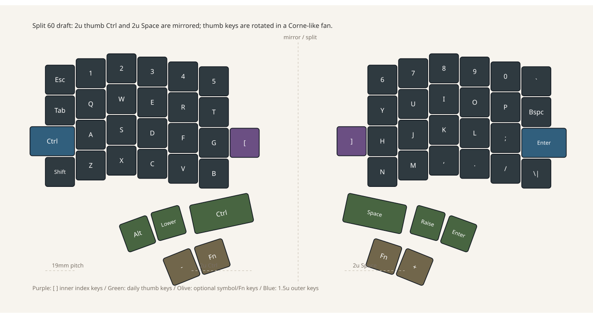

# レイアウト案

## 概要

Lily58 系より記号に強い split ergonomic 構成です。現行 Ergogen 案は左右それぞれ 31 キー、合計 62 キーです。メイン部は基本 4 行 x 6 列に、T/Y の内側へ `-` / `+`、G/H の内側へ `[` / `]` を足します。親指クラスタは片手 5 キーにして、常用は押しやすい 3 キーに絞ります。

手持ちの ortho 系 1u キーキャップを中心に使い、少数ある 2u と 1.5u は親指クラスタと外側修飾キーに割り当てます。

## Base layer

図面ラフ:



Ergogen 生成プレビュー:


```text
Left                                      Right

Esc   1   2   3   4   5                  6   7   8   9   0   `
Tab   Q   W   E   R   T   -          +   Y   U   I   O   P   Backspace
Ctrl  A   S   D   F   G   [          ]   H   J   K   L   ;   Enter
Shift Z   X   C   V   B                  N   M   ,   .   /   \|

          Alt Lower Ctrl(2u)           Space(2u) Raise Enter
                 Fn                    Fn
```

## キーキャップ活用

- 1u: 英数字、記号、基本的な修飾キーに使う。
- 2u: 左親指 `Ctrl` と右親指 `Space` に使う。左右の親指主キーを同じ大きさ・角度にして、見た目と押し心地の対称性を優先する。
- 1.5u: 左外側 `Ctrl` と右外側 `Enter` の候補にする。どちらも外側へ突き出す配置にして、左右の列間隔を対称にしやすくする。
- 親指クラスタ下段は `Fn` のみ残す。`-` / `+` は T/Y の内側へ移し、人差し指で押せる記号キーにする。

## レイヤ方針

- `[` と `]` は Base layer の内側人差し指キーに置く。
- Lower は `{}`, `()`, その他記号、カーソル移動を中心にする。
- Raise は function keys、追加記号、必要なら media / mouse keys を置く。
- Emacs 用に `Ctrl` は左ホーム列と左親指の両方に置ける構成にする。
- `Enter` は右外側にも残しつつ、右親指にも置く。親指 Enter に慣れる余地を作る。
- `Alt` は `Ctrl+Alt+...` を押しやすいよう、左親指の常用3キー内に置く。左親指で `Ctrl(2u)` と `Alt` を押し分けられることを優先する。
- `-` と `+` は T/Y の内側に置く。B/N 内側より上段寄りで、親指クラスタと干渉しにくい位置を優先する。

## PCB 上の注意

- 2u 候補位置はスタビライザー穴を検討する。
- 1.5u 候補位置はキーキャップ干渉と隣接キー間隔を確認する。
- メイン部は 1u 前提で、左 `Ctrl` は左外側へ、右 `Enter` は右外側へ突き出す。内側に食わせない。
- 親指クラスタは Corne の「3 thumb keys」を参考に、常用3キーを扇形にまとめる。追加1キーは `Fn` として主動線から少し外す。
- 左親指 `Ctrl` と右親指 `Space` はどちらも 2u とし、鏡映対称の位置・角度にする。他の親指キーも同じ扇形に沿って回転させる。

## 拡張候補

60 キーへ戻すなら、左右の `Fn` を削るのが最も素直です。現行案は `-` / `+` と `[` / `]` を Base layer に残すため、62 キーを許容しています。

物理キーとしてさらに増やすなら、B/N の内側へ追加記号を置く案があります。ただし B/N の内側は親指クラスタと近く、下段の人差し指移動も増えるため優先度を下げます。
- column stagger は控えめな段差にして、HHKB から移行しても指が迷いにくい範囲にする。
- `E/D/C` と `I/K/,` に近い middle column をピークにして、QからW/Eへ上げ、R/Tへ向けて下げる。`T/G/B` と `Y/H/N` の inner column はQ列と同じ高さへ戻し、日本語入力、Emacs、tmux で内側人差し指を酷使しやすい前提で、上段内側キーを無理に高くしない。
- 親指クラスタはB/Nのすぐ内側下に2u主キーを置き、その内側に1u、そのさらに内側に1.5u水平キーを置く。
- 左右別基板なので、シルクと部品向きは読みやすさを優先する。
